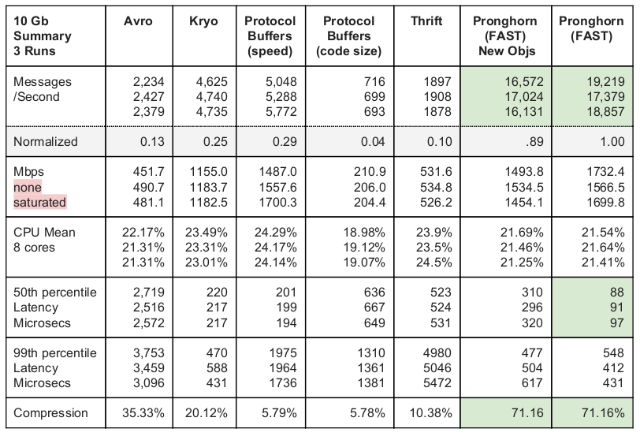

# ProtocolTestProject
Testing the speed of different protocols
=============================

#How to Run

1.  Build the project with      
       mvn install    
2.  Look in the target folder for the protoTest.jar     
       This jar is fully self contained you can use it here or copy it elsewhere    
3.  Run the test for a specfic protocol    
       java -jar protoTest.jar -t Kryo -b 10000 -w 5000            
       -t Kryo, Avro, Thrift, PBSize, PBSpeed, Pronghorn    
       -b million bits per second, eg 1000 is 1Gbps     
       -W timeout in seconds to quit test with error     

#Test Data 
Any message structure used for a performance comparison requires a substantial setup time but, 
once time is allowed for the setup, more testing with other message structures can certainly be done.     
 
This report is exclusively focused on the results of messages using the following structure:     
 
Single Message     
int UserId               (Medium sized integers > 100,000)    
int Year                  (Small integers starting with 2015, incrementing every 16 months)      
int Month                (Small integers between 1 and 16, incrementing every 32 days)     
int Day                    (Small integers between 1 and 32, incrementing every message)       
int sampleCounts   (Fixed to 2048 for every message)    
    <one sample for each of the above counts>    
  
Single Sample     
int    SampleId        (Value < 2048)     
long TimeStamp     (Time in ms stepping by 12 hours between each)     
int    Measurement  (Value < 4096)     
int    Action              (Value between 0 and 15; the value is 5 in 86% of the samples)     
 
In memory, the test messages before any compression are about 40KB in size.     

#10 Gigabit per Second Test Runs 
None of the implemented solutions could saturate a 10Gb network connection.  It appears that a 
single thread may not be able to push more than 1.7 Gbps. Still, pushing over 10Gbps may still be 
possible by using multiple channels or multiplexing.  
 
Test run details (for this table and the following two tables): 
Record Count: 100,000 
 
Java Version: Oracle JDK 1.8.0 
Operating System: Ubuntu 14.04 
CPU: Intel® CoreTM i7­4910MQ CPU @ 2.90GHz × 8  
 
Even when full objects are created for each of the 100,000 records, Pronghorn continues to move 
three times as many records as Protocol Buffers.  Experience shows that the compression levels for 
Pronghorn can vary from 50% up to 80%, based on the message structure and data behavior. 
Compression values > 60% are very common. 
 

 
Pronghorn with object creation is only shown on this table since the others are throttled by the network 
and object creation does not end up changing the results in any significant way. 